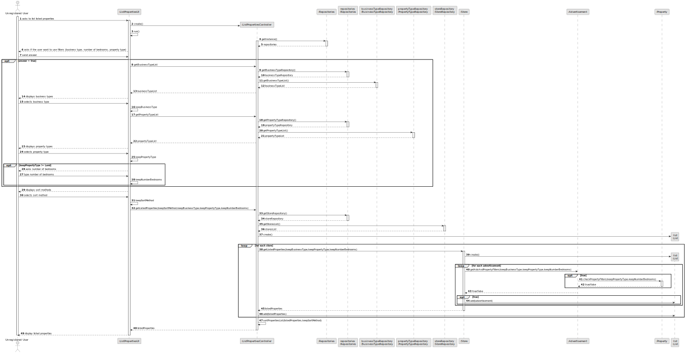
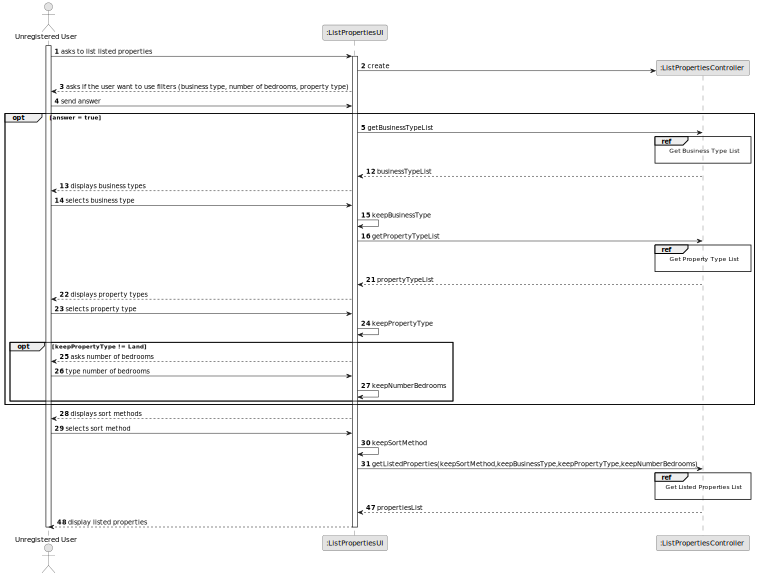
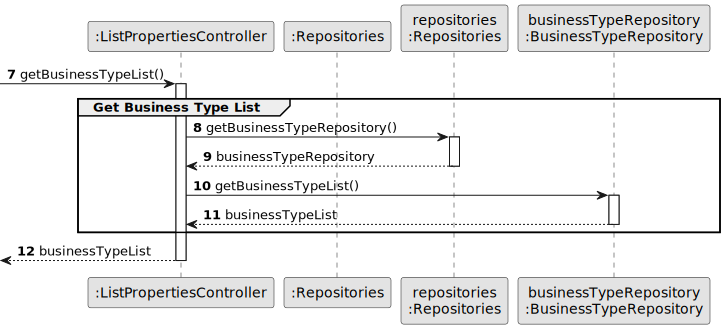
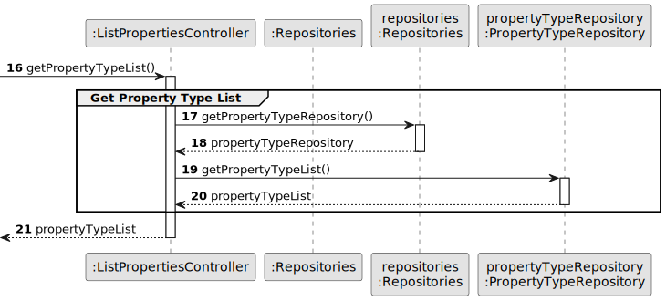
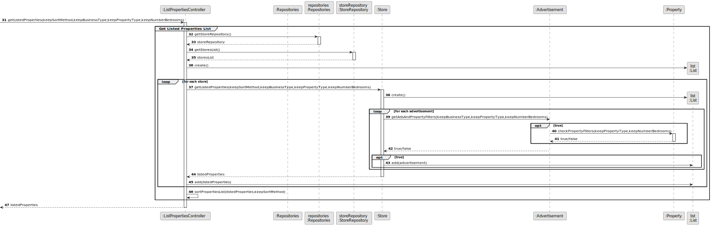
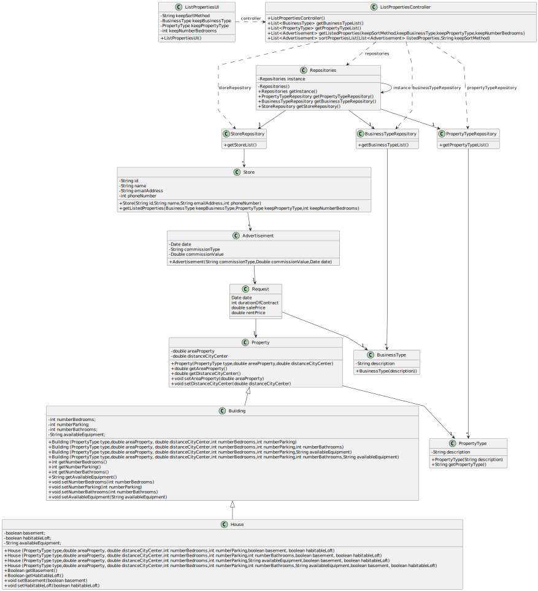

# US 001 - List Properties 

## 3. Design - User Story Realization 

### 3.1. Rationale

| Interaction ID | Question: Which class is responsible for... | Answer                   | Justification (with patterns)                                                                                 |
|:---------------|:--------------------------------------------|:-------------------------|:--------------------------------------------------------------------------------------------------------------|
| Step 1         | ... interacting with the actor?             | ListPropertiesUI         | Pure Fabrication: there is no reason to assign this responsibility to any existing class in the Domain Model. |
|                | ... coordinating the US?                    | ListPropertiesController | Controller                                                                                                    |
|                | ... get Properties listed list?             | Store                    | Creator (Rule 1): in the DM Store has several Advertisements.                                                 |
| Step 2         | ... knowing the business types to show?     | BusinessTypeRepository   | IE: Business Types are bootstrapped in the system.                                                            |
|                | ... knowing the property types to show?     | PropertyTypeRepository   | IE: Property Types are bootstrapped in the system.                                                            |
|                | ... sort listed properties list?            | ListPropertiesController |                                                                                                               |
| Step 3         | ... display listed properties?              | ListPropertiesUI         | IE: is responsible for user interactions.                                                                     | 

### Systematization ##

According to the taken rationale, the conceptual classes promoted to software classes are: 

 * Advertisement
 * Property
 * PropertyType
 * BusinessType

Other software classes (i.e. Pure Fabrication) identified: 

 * ListPropertiesUI  
 * ListPropertiesController

## 3.2. Sequence Diagram (SD)

### Alternative 1 - Full Diagram

This diagram shows the full sequence of interactions between the classes involved in the realization of this user story.

### Alternative 2 - Split Diagram

This diagram shows the same sequence of interactions between the classes involved in the realization of this user story, but it is split in partial diagrams to better illustrate the interactions between the classes.

It uses interaction ocurrence.

**Get Business Type List SD**

**Get Property Type List SD**

**Get Listed Properties List SD**

## 3.3. Class Diagram (CD)

