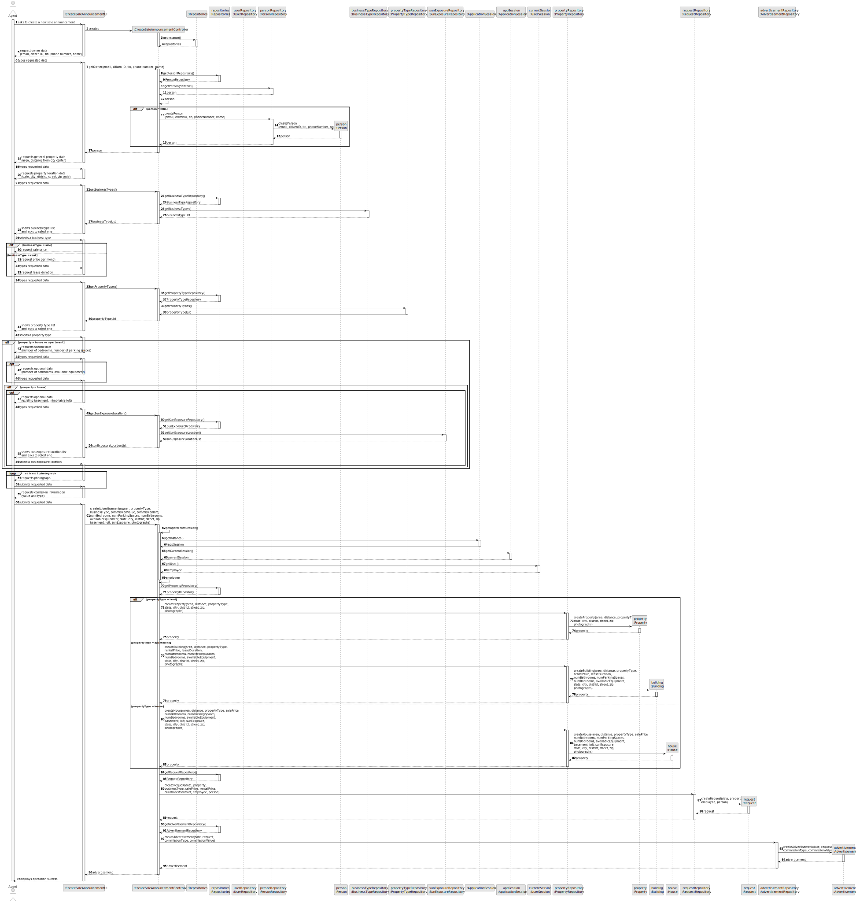
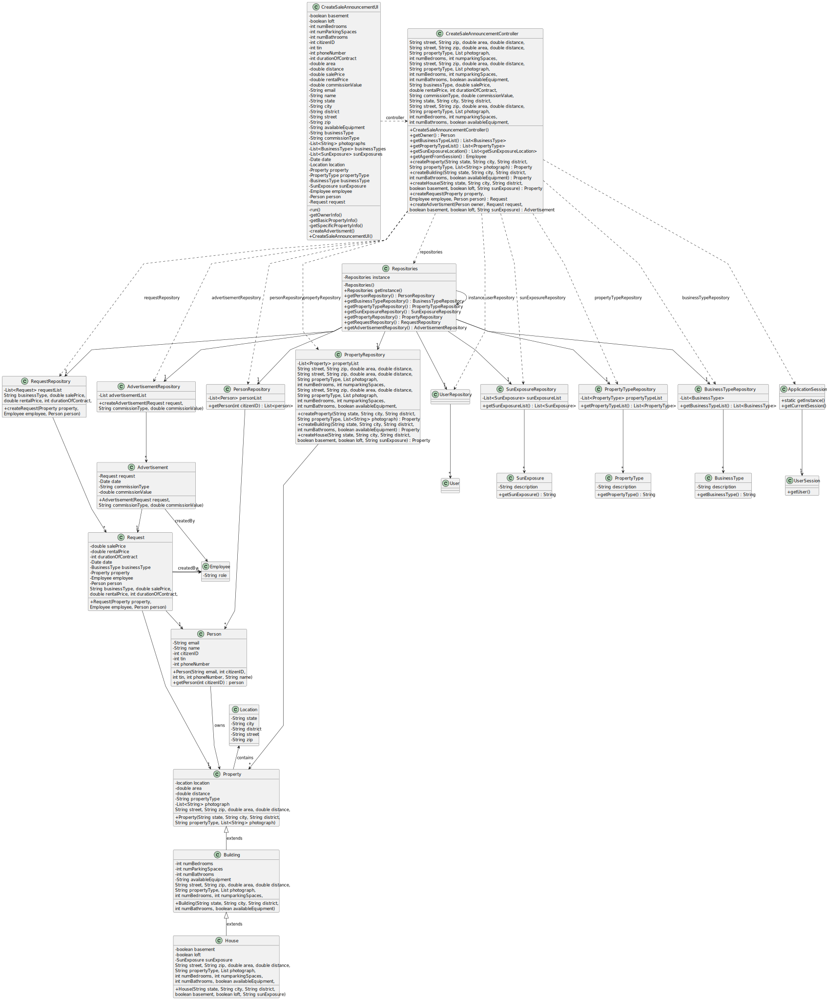

# US 002 - Publish Sale Announcement

## 3. Design - User Story Realization 

### 3.1. Rationale

| Interaction ID | Question: Which class is responsible for... | Answer | Justification (with patterns) |
|:-------------  |:--------------------- |:---------------------|:--------------------------------------------------------------------------------------------------------------|
| Step 1 | ... interacting with the actor? | createSaleAnnouncementUI | Pure Fabrication: there is no reason to assign this responsibility to any existing class in the Domain Model. |
| | ... coordinating the US? | createSaleAnnouncementController | Controller |
| | ... knowing the user using the system? | UserSession | IE: cf. A&A component documentation. |
| Step 2 | ... asking the required owner data? | CreateSaleAnnouncementeUI | interacts with the actor |
| | ... typing the required owner data | User (actor) | knows the information |
| Step 3 | ... finding or creating the owner in the system? | PersonRepository | the repository is responsible for knowing and creating persons |
| Step 4 | ... ask the required property data | CreateSaleAnnouncementeUI | interacts with the actor |
| | ... chooses the required data of the property | User (actor) | knows the information |
| Step 5 | ... get business Type | BusinessTypeRepository | Repository of the Type of Business in the Company |
| | ... display business Type to choose | CreateSaleAnnouncementeUI | interacts with the actor |
| | ... chooses business Type | User (actor) | knows the information |
| Step 6 | ... get property Type | PropertyTypeRepository | Repository of the Type of Property in the Company |
| | ... display property Type to choose | CreateSaleAnnouncementeUI | interacts with the actor |
| | ... chooses property Type | User (actor) | knows the information |
| Step 7 | ... ask the required property data | CreateSaleAnnouncementeUI | interacts with the actor |
| | ... chooses the required data of the property | User (actor) | knows the information |
| Step 8 | ... asks additional property data | CreateSaleAnnouncementeUI | interacts with the actor |
| | ... chooses the additional data of the property | User (actor) | knows the information |
| Step 9 | ... asks commission information | CreateSaleAnnouncementeUI | interacts with the actor |
| | ... chooses commission information | User (actor) | knows the information |
| Step 10 | ... creating the property in the system? | PropertyRepository | the repository is responsible for knowing and creating properties |
| Step 11 | ... creating the request in the system? | RequestRepository | the repository is responsible for knowing and creating requests |
| Step 12 | ... creating the advertisement in the system? | AdvertisementsRepository | the repository is responsible for knowing and creating advertisements |

### Systematization ##

According to the taken rationale, the conceptual classes promoted to software classes are: 
 * PropertyTypeRepository
 * BusinessTypeRepository
 * PersonRepository
 * PropertyRepository
 * RequestRepository
 * AdvertisementsRepository

Other software classes (i.e. Pure Fabrication) identified: 
 * CreateSaleAnnouncementeUI
 * createSaleAnnouncementController

## 3.2. Sequence Diagram (SD)

### Alternative 1 - Full Diagram

This diagram shows the full sequence of interactions between the classes involved in the realization of this user story.

<!-- 
### Alternative 2 - Split Diagram

This diagram shows the same sequence of interactions between the classes involved in the realization of this user story, but it is split in partial diagrams to better illustrate the interactions between the classes.

It uses interaction ocurrence.

**Get Task Category List Partial SD**

**Get Task Category Object**

**Get Employee**

**Create Task**

 -->

## 3.3. Class Diagram (CD)

