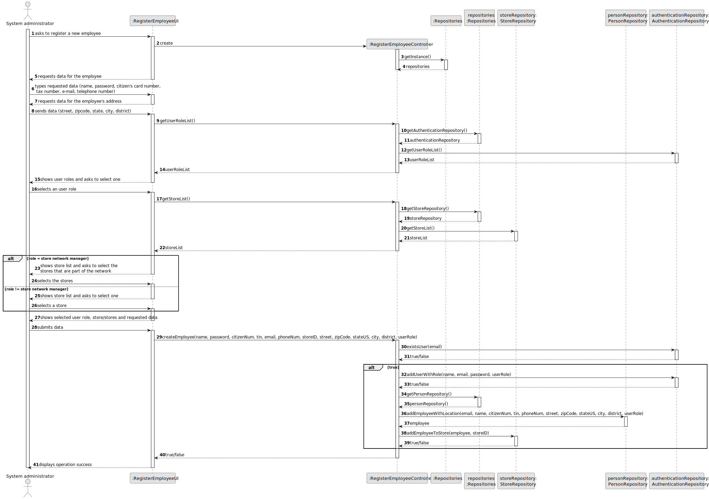

# US 003 - Register a new employee

## 3. Design - User Story Realization 

### 3.1. Rationale

**SSD - Alternative 1 is adopted.**

| Interaction ID | Question: Which class is responsible for... | Answer                     | Justification (with patterns)                                                                                 |
|:---------------|:--------------------------------------------|:---------------------------|:--------------------------------------------------------------------------------------------------------------|
| Step 1         | ... interacting with the actor?             | RegisterEmployeeUI         | Pure Fabrication: there is no reason to assign this responsibility to any existing class in the Domain Model. |
|                | ... coordinating the US?                    | RegisterEmployeeController | Controller                                                                                                    |
|                | ... instantiating a new employee?           | PersonRepository           | IE: Employee extends to Person                                                                                |
|                | ... knowing the user using the system?      | UserSession                | IE: cf. A&A component documentation.                                                                          |
| Step 2         | ... saves the inputted data                 | Person                     | IE: object created in step 1 has its own data.                                                                |
| Step 3         | ... get user role list                      | PersonRepository           | IE: The PersonRepository knows the roles.                                                                     |
| Step 4         | ... saves the selected roles                | Person                     | IE: object created in step 1 has its own data.                                                                |
| Step 5         | ... get store list                          | StoreRepository            | IE: The StoreRepository knows its stores                                                                      |
| Step 6         | ... saves the selected agencies             | Person                     | IE: object created in step 1 has its own data.                                                                |
| Step 7         | ... validates all data (local validation)?  | Person                     | IE: owns its data.                                                                                            |
|                | ... validates all data (global validation)? | Store                      | IE: knows all its employees.                                                                                  |
|                | ... saving the created person?              | Person                     | IE: owns all its data.                                                                                        |
|                | ... saving the created employee?            | Employee                   | IE: owns all its data.                                                                                        |
|                | ... connecting the employee to the agency?  | Store                      | IE: owns all its employees.                                                                                   |
| Step 8         | ... informing operation success?            | RegisterEmployeeUI         | IE: is responsible for user interactions.                                                                     | 

### Systematization ##

According to the taken rationale, the conceptual classes promoted to software classes are: 

 * Employee
 * Person
 * Store

Other software classes (i.e. Pure Fabrication) identified: 

 * RegisterEmployeeUI  
 * RegisterEmployeeController

## 3.2. Sequence Diagram (SD)

### Alternative 1 - Full Diagram

This diagram shows the full sequence of interactions between the classes involved in the realization of this user story.

### Alternative 2 - Split Diagram

This diagram shows the same sequence of interactions between the classes involved in the realization of this user story, but it is split in partial diagrams to better illustrate the interactions between the classes.

It uses interaction ocurrence.

**Get Repositories**

**Get User Role List**

**Get Store List**

**Create User**

## 3.3. Class Diagram (CD)

