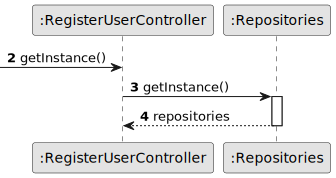

# US 007 - Register in the system 

## 3. Design - User Story Realization 

### 3.1. Rationale

| Interaction ID | Question: Which class is responsible for...    | Answer                              | Justification (with patterns)                                                                                 |
|:---------------|:-----------------------------------------------|:------------------------------------|:--------------------------------------------------------------------------------------------------------------|
| Step 1  	      | ... interacting with the actor?                | RegisterUserUI                      | Pure Fabrication: there is no reason to assign this responsibility to any existing class in the Domain Model. |
| 	              | ... coordinating the US?                       | RegisterUserController              | Controller                                                                                                    |
|                | ... instantiating a new User and a new Person? | Organization                        | Creator (Rule 1): in the DM Organization has a Task.                                                          |
|                |                                                | UserRepository and PersonRepository | IE: UserRepository knows/has its own users and PersonRepository knows/has its own persons                     |
|                |                                                | User and Person                     | IE: User knows its own data (e.g. email) and Person knows its own data                                        |
| Step 2         | ...saving the inputted data?                   | User and Person                     | IE: object created in step 1 has its own data.                                                                |
| Step 3         | ... validating all data (local validation)?    | User and Person                     | IE: owns its data.                                                                                            | 
|                | ... validating all data (global validation)?   | UserRepository and PersonRepository | IE: UserRepository knows all its users and PersonRepository knows all its persons.                            | 
| 	              | ... saving the created user and person?        | UserRepository and PersonRepository | IE: UserRepository knows all its users and PersonRepository knows all its persons.                            | 
| Step 5         | ... informing operation success?               | RegisterUserUI                      | IE: is responsible for user interactions.                                                                     | 

### Systematization ##

According to the taken rationale, the conceptual classes promoted to software classes are: 

 * Person

Other software classes (i.e. Pure Fabrication) identified: 

 * RegisterUserUI  
 * RegisterUserController

## 3.2. Sequence Diagram (SD)

This diagram shows the full sequence of interactions between the classes involved in the realization of this user story.

### Alternative 2 - Split Diagram

This diagram shows the same sequence of interactions between the classes involved in the realization of this user story, but it is split in partial diagrams to better illustrate the interactions between the classes.

It uses interaction ocurrence.

**Get Repositories Acess Partial SD**

**Register User With Client And Owner Perms**

## 3.3. Class Diagram (CD)

