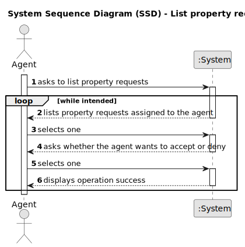

# US 008 - List Property Announcement Requests

## 1. Requirements Engineering

### 1.1. User Story Description

As an agent, I intend to see the list of property announcement requests made
to myself, so that I can post the announcement.

### 1.2. Customer Specifications and Clarifications 

**From the specifications document:**

>	Upon receiving the order, the agent sets the commission and publishes the offer in the system. The commission can be a fixed ammount or a percentage.

>	The real estate agent reviews advertisement requests, registers the information in the system and publishes the offer so that it is visible to all clients who visit the agency and use the application. All registeres information, except the agency commission, can be acessed by the client who intends to buy or rent the property: the client is, then, responsible for being able to consult the properties by type, number of rooms, and sort by criteria such as price or the parish where the property is located. 

**From the client clarifications:**

> **Question:** Does the customer have any say in setting the commission (agree or deny, eg: commission too high so I withdraw the ad request) or is the commission solely set by the agent without customer approval? 
> 
> **Answer:** The agent should, firstly, set the commission and then publishes the offer in the system. The sale price (the USD value that is shown in the announcement) should include the commission value (owner requested price + commission) and should not show the commission. The commission is only specified when the agent accepts the request. 

> **Question:**  In this US8, will it be necessary to show search criteria? If so, which ones?
> 
> **Answer:** There is no search criteria.

> **Question:** About US08, since as an agent I intend to see the advertisement requests made to me in order to publish the chosen advertisement after consulting the list, why should there be an option to reject it since the previously chosen advertisement had already the intention of being published.The rejection operation shouldn't be described as another feature?
> 
> **Answer:**  I want to check all property announcement requests and have the option to accept or reject any announcement request. The property owner is a human being and can make errors like any other human being...

> **Question:** Is the owner responsible to assigning the property to an agent or there are other ways to do that?
> 
> **Answer:**  In US8 we get "As an agent, I intend to see the list of property announcement requests made to myself, so that I can post the announcement". In this US the agent is the actor.

> **Question:** Regarding US008, can the agent decline an announcement request?
>
> **Answer:**  Yes. The agent must include a message justifying the rejection.

> **Question:** Can the agent select multiple requests at the same time?
> 
> **Answer:**  No. The agent can only post one announcement at a time.

> **Question:** When displaying the property announcement requests in the system to the agent besides them being ordered from most recent to oldest is there a need to display the specific day where the requests were published?
> 
> **Answer:**  The list of property announcement requests should be sorted by the date they were created, with the most recent requests appearing first. The system should show the date when the property announcement requests was made.

### 1.3. Acceptance Criteria

* **AC1:** The Agent must be a registered employee.
* **AC2:** The list of property announcement requests should be sorted by the date they were created, with the most recent requests appearing first.
* **AC3:** An announcement is posted when a request is accepted. The list of requests should be refreshed, and that request should not be shown again.
* **AC4:** All required fields must be filled in.

### 1.4. Found out Dependencies

* There is a dependency to "US003 - Registering a new employee" since an agent needs to be a registered employee so as to be able to publish the offer.
* There is a dependency to "US 004 - Owner Submit A Request For Listing A Property" since request have to have been made before hand so that the agent may accept or reject them.

### 1.5 Input and Output Data

**Input Data:**

* Typed data:
    * commission value.

**Output Data:**

* (In)Success of the operation

### 1.6. System Sequence Diagram (SSD)

**Other alternatives might exist.**

