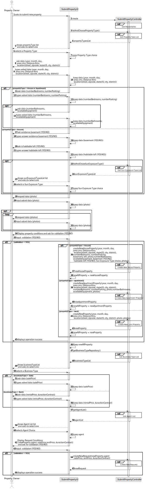
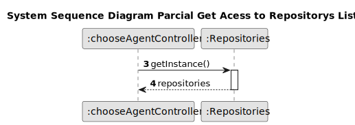
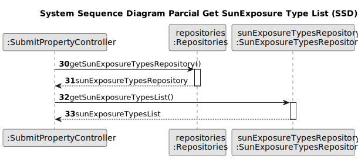
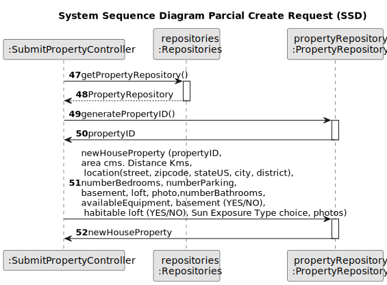
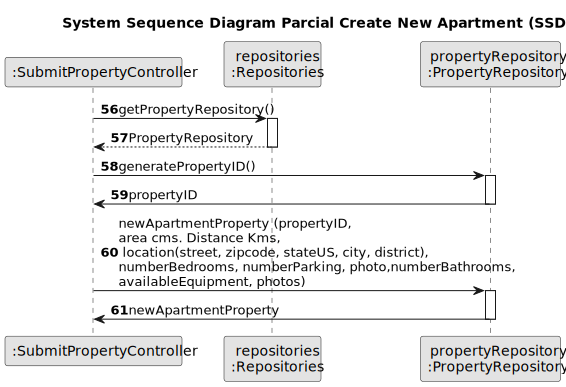
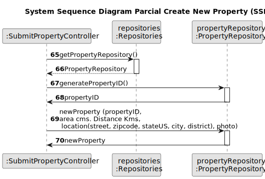
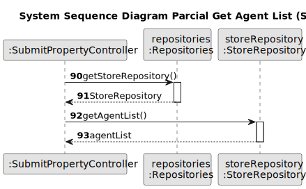
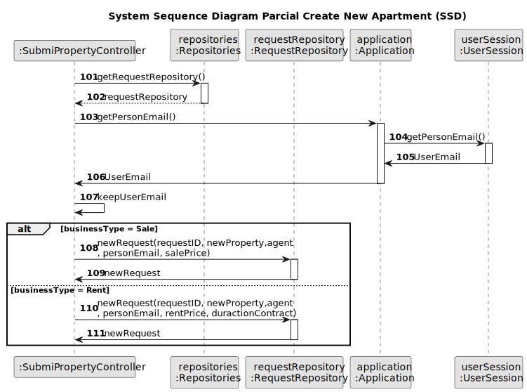
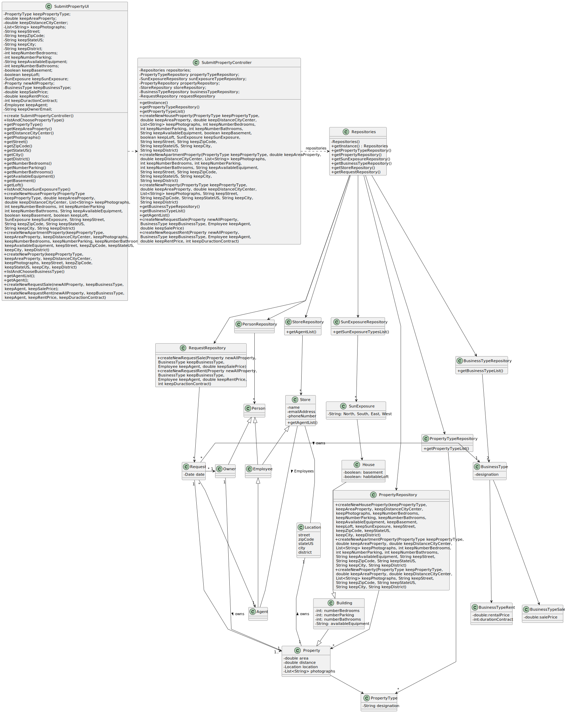

# US 004 - Owner Submit A Request For Listing A Property

## 3. Design - User Story Realization 

### 3.1. Rationale

**SSD - Alternative 1 is adopted.**

| Interaction ID | Question: Which class is responsible for...        | Answer                   | Justification (with patterns)                                                                                     |
|:---------------|:---------------------------------------------------|:-------------------------|:------------------------------------------------------------------------------------------------------------------|
| Step 1  	      | ... interacting with the actor?                    | SubmitPropertyUI         | Pure Fabrication: there is no reason to assign this responsibility to any existing class in the Domain Model.     |
|                | ... coordinating the US?                           | SubmitPropertyController | Controller                                                                                                        |
|                | ... knowing the user using the system?             | UserSession              | IE: cf. A&A component documentation.                                                                              |
| Step 2         | ... get property Type                              | PropertyTypeRepository   | Repository of the Type of Property in the Company                                                                 |
|                | ... display property Type to choose                | SubmitPropertyUI         | interacts with the actor                                                                                          |
| 	              | ... chooses property Type                          | User (actor)             | knows the information                                                                                             |
| Step 3         | ... ask the required data of the property          | SubmitPropertyUI         | interacts with the actor                                                                                          |
|                | ... chooses the required data of the property      | User (actor)             | knows the information                                                                                             |
| Step 4         | ... display Property conditions ask for validation | SubmitPropertyUI         | interacts with the actor                                                                                          |
|                | ... validates the conditions                       | User (actor)             | knows the information                                                                                             |
| Step 5         | ... get Business Type                              | BusinessTypeRepository   | Repository of the Type of Business for the Property (Sale or Rent)   /  needed to create Request to Advertisement |
|                | ... display Business Type to choose                | SubmitPropertyUI         | interacts with the actor                                                                                          |
| 	              | ... chooses Business Type                          | User (actor)             | knows the information                                                                                             |
| Step 6         | ... get Agent Responsable                          | StoreRepository          | Repository of the Stores in the Property in the Company (Stores Employs the Agents  /  needed to create Request   |
|                | ... display Agent List to choose                   | SubmitPropertyUI         | interacts with the actor                                                                                          |
| 	              | ... chooses Agent                                  | User (actor)             | knows the information                                                                                             |
| Step 7         | ... display Property conditions ask for validation | SubmitPropertyUI         | interacts with the actor                                                                                          |
|                | ... validates the conditions                       | User (actor)             | knows the information                                                                                             |
| Step 8         | ... Create New Request to Advertise Property       | RequestRepository        | Repository of the Request in the Property                                                                         |
| Step 9         | ... informing operation success?                   | SubmitPropertyUI         | Is responsible for user interactions.                                                                             | 

### Systematization ##

According to the taken rationale, the conceptual classes promoted to software classes are: 

 * PropertyTypeRepository
 * BusinessTypeRepository
 * StoreRepository
 * RequestRepository

Other software classes (i.e. Pure Fabrication) identified: 

 * SubmitPropertyUI  
 * SubmitPropertyController

## 3.2. Sequence Diagram (SD)

### Alternative 1 - Full Diagram

This diagram shows the full sequence of interactions between the classes involved in the realization of this user story.

### Alternative 2 - Split Diagram

This diagram shows the same sequence of interactions between the classes involved in the realization of this user story, but it is split in partial diagrams to better illustrate the interactions between the classes.

It uses interaction ocurrence.

**Get Repositories Acess Partial SD**

**Get Property Type List**

**Get Sun Exposure Type List**

**Create New House Property**

**Create New Apartment Property**

**Create New Land Property**

**Get Business Type List**

**Get Agent List**

**Create New Request**

## 3.3. Class Diagram (CD)

