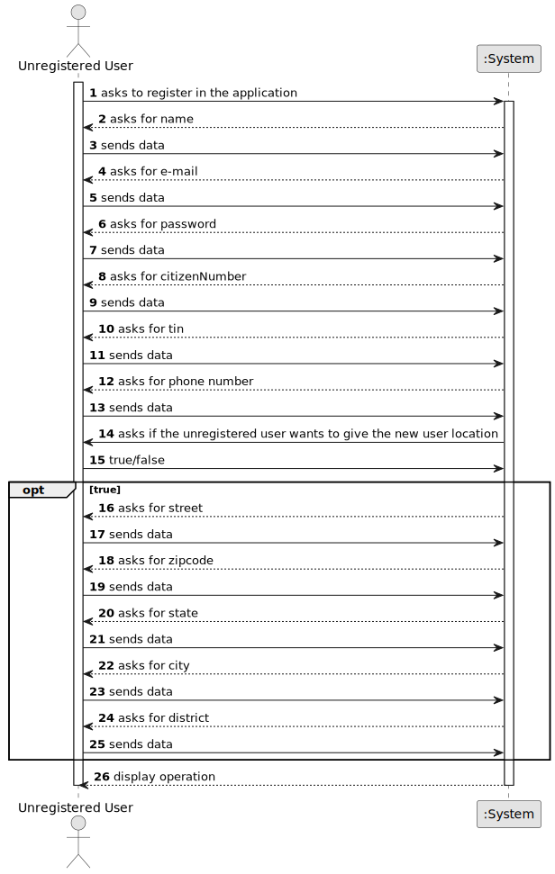

# US 007 - Register in the system 

## 1. Requirements Engineering

### 1.1. User Story Description

As an unregistered user, I want to register in the system to buy, sell or rent
properties.

### 1.2. Customer Specifications and Clarifications 

**From the specifications document:**

>	All those who wish to use the application must be authenticated with a password of seven alphanumeric characters, including three capital letters and two digits.

**From the client clarifications:**

> **Question:** When a user registers in the system, does it need to specify for which transactional activities or all registered users can buy sell and rent?
>  
> **Answer:** All registered users can buy sell and rent.

> **Question:** After the users fills all the required information, is the user automatically registered in the system, or is there any other role that will review and approve the user registration?
>
> **Answer:** The system should automatically validate the registration.

> **Question:** When an unregistered user wants to register a new account in the system, the set of parameters that are asked are the following: name, citizen card number, tax number, email, phone number, and password. Do you want any extra parameters/requirements to be asked or just the ones specified above? If so, which ones are mandatory?
>
> **Answer:** The Owner attributes are: the name, the citizen's card number, the tax number, the address, the email address and the contact telephone number. The address of the owner is not mandatory.

> **Question:** Does the user also receive the password via email or can he choose a password when registering?
>
> **Answer:** The owner can choose a password when registering.

### 1.3. Acceptance Criteria

* **AC1:** Unregistered user must have an unique email.
* **AC2:** Unregistered user must obey password rules.

### 1.4. Found out Dependencies

* None

### 1.5 Input and Output Data

**Input Data:**

* Typed data:
	* Email
    * Password
    * Name
    * Location
    * Tin
    * Phone Number
    * Citizen Number
    * Street
    * ZipCode
    * City
    * District
    * StateUS
	
* Selected data:
    * None 

**Output Data:**

* Operation Success

### 1.6. System Sequence Diagram (SSD)

### 1.7 Other Relevant Remarks

* Unregistered users when registered will have owner and client permissions.