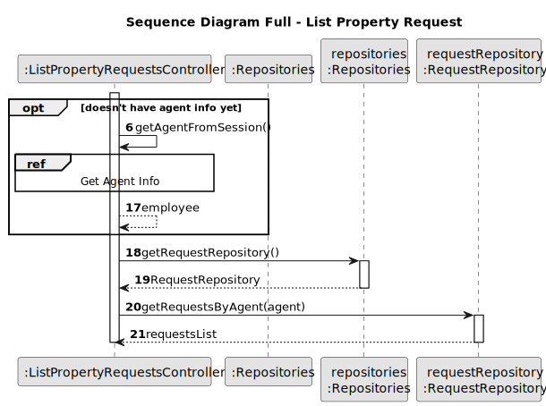

# US 008 - List Property Announcement Requests

## 3. Design - User Story Realization

### 3.1. Rationale

| Interaction ID | Question: Which class is responsible for...   | Answer                         | Justification (with patterns)                                                                                               |
| :------------- | :-------------------------------------------- | :----------------------------- | :-------------------------------------------------------------------------------------------------------------------------- |
| Step 1         | ... interacting with the actor?               | ListPropertyRequestsUI         | Pure Fabrication: there is no reason to assign this responsibility to any existing class in the Domain Model.               |
|                | ... coordinating the US?                      | ListPropertyRequestsController | Controller                                                                                                                  |
|                | ... knowing the user using the system?        | UserSession                    | IE: cf. A&A component documentation.                                                                                        |
| Step 2         | ... getting request list?                     | RequestRepository              | Information Expert - Repository that creates and saves a list of requests that are created                                  |
|                | ... answering the prompt to accept or reject  | User (actor)                   | knows the information                                                                                                       |
| Step 3         | ... removing the request from the repository? | RequestRepository              | Information Expert - Repository The repository is responsible for keeping info on requests, thus it should also remove them |
| Step 4         | ... ask the required commission information?  | ListPropertyRequestsUI         | interacts with the actor                                                                                                    |
|                | ... chooses the appropriate value?            | User (actor)                   | knows the information                                                                                                       |
| Step 5         | ... get commission type?                      | CommissionType                 | Enum class that holds all the commission types                                                                              |
|                | ... display commission type to choose         | CreateSaleAnnouncementeUI      | interacts with the actor                                                                                                    |
|                | ... chooses commission type?                  | User (actor)                   | knows the information                                                                                                       |
| Step 6         | ... removing the request from the repository? | RequestRepository              | Information Expert - Repository The repository is responsible for keeping info on requests, thus it should also remove them |
|                | ... creating the advertisement?               | AdvertisementRepository        | Information Expert - Repository saves a list of advertisement, thus it should also create them                              |

### Systematization

According to the taken rationale, the conceptual classes promoted to software classes are:

- CommissionType
- PersonRepository
- RequestRepository
- AdvertisementsRepository

Other software classes (i.e. Pure Fabrication) identified:

- ListPropertyRequestsUI
- ListPropertyRequestsController

## 3.2. Sequence Diagram (SD)

### Alternative 1 - Full Diagram

This diagram shows the full sequence of interactions between the classes involved in the realization of this user story.

### Alternative 2 - Split Diagram

This diagram shows the same sequence of interactions between the classes involved in the realization of this user story, but it is split in partial diagrams to better illustrate the interactions between the classes.

It uses interaction ocurrence.

**Get Repositories**

**Get Request List**

**Get Agent Info**

**Removes Request**

**Get Commission Type**

**Create Advertisement**

## 3.3. Class Diagram (CD)

