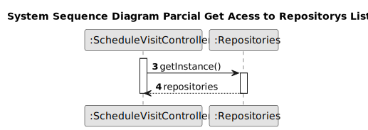

# US 009 - Client Schedule Visit

## 3. Design - User Story Realization 

### 3.1. Rationale

**SSD - Alternative 1 is adopted.**

| Interaction ID | Question: Which class is responsible for...     | Answer                    | Justification (with patterns)                                                                                 |
|:---------------|:------------------------------------------------|:--------------------------|:--------------------------------------------------------------------------------------------------------------|
| Step 1  	      | ... interacting with the actor?                 | ScheduleVisitUI           | Pure Fabrication: there is no reason to assign this responsibility to any existing class in the Domain Model. |
|                | ... coordinating the US?                        | ScheduleVisitController   | Controller                                                                                                    |
|                | ... knowing the user using the system?          | UserSession               | IE: cf. A&A component documentation.                                                                          |
| Step 2         | ... get property Type                           | PropertyTypeRepository    | Repository of the Type of Property in the Company (Information Expert)                                        |
|                | ... display property Type to choose             | SubmitPropertyUI          | interacts with the actor                                                                                      |
| 	              | ... chooses property Type                       | User (actor)              | knows the information                                                                                         |
| Step 3         | ... get Business Type                           | BusinessTypeRepository    | Repository of the Type of Business for the Property (Sale or Rent) (Information Expert)                       |
|                | ... display Business Type to choose             | ScheduleVisiUI            | interacts with the actor                                                                                      |
| 	              | ... chooses Business Type                       | User (actor)              | knows the information                                                                                         |
| Step 4         | ... get Advertisement List                      | AdvertisementRepository   | Repository of the Advertisements in the Company (Information Expert)                                          |
|                | ... transforms Advertisement in AdvertismentDTO | AdvertisementMapper       | Creator                                                                                                       |
|                | ... create Advertisement DTO List               | AdvertisementCollections  | creates List of AdvertisementDTO    (Information Expert)                                                      |
|                | ... display Advertisement DTO List to choose    | ScheduleVisitUI           | interacts with the actor                                                                                      |
| 	              | ... chooses Advertisement DTO                   | User (actor)              | knows the information                                                                                         |
| Step 5         | ... ask the required data for the Visit         | ScheduleVisitUI           | interacts with the actor                                                                                      |
|                | ... chooses the required data for the Visit     | User (actor)              | knows the information                                                                                         |
|                | ... transforms AdvertismentDTO in Advertisement | AdvertisementMapper       | seeks Ad in the AdvertisementDTO (Information Expert)                                                         |
|                | ... validates data for the Visit                | AdvertisementRepository   | Repository of the Advertisements in the Company (Information Expert)                                          |
| Step 6         | ... display Visit conditions ask for validation | SubmitPropertyUI          | interacts with the actor                                                                                      |
|                | ... validates the conditions                    | User (actor)              | knows the information                                                                                         |
| Step 8         | ... Create New Visit in the Advertisement       | AdvertisementRepository   | Repository of the Advertisements in the Company (Information Expert)                                          |
| Step 9         | ... informing operation success?                | SubmitPropertyUI          | Is responsible for user interactions.                                                                         | 

### Systematization ##

According to the taken rationale, the conceptual classes promoted to software classes are: 

 * PropertyTypeRepository
 * BusinessTypeRepository
 * AdvertisementRepository

Other software classes (i.e. Pure Fabrication) identified: 

 * SubmitPropertyUI  
 * SubmitPropertyController
 * AdvertisementMapper
 * AdvertisementCollections

## 3.2. Sequence Diagram (SD)

### Alternative 1 - Full Diagram

This diagram shows the full sequence of interactions between the classes involved in the realization of this user story.

### Alternative 2 - Split Diagram

This diagram shows the same sequence of interactions between the classes involved in the realization of this user story, but it is split in partial diagrams to better illustrate the interactions between the classes.

It uses interaction ocurrence.

**Get Repositories Acess Partial SD**

**Get Property Type List**

**Get Business Type List**

**Get AdvertismentDTOList Sorted By Date**

**Get Client Email**

**Verify If Time Choice is Free**

## 3.3. Class Diagram (CD)

