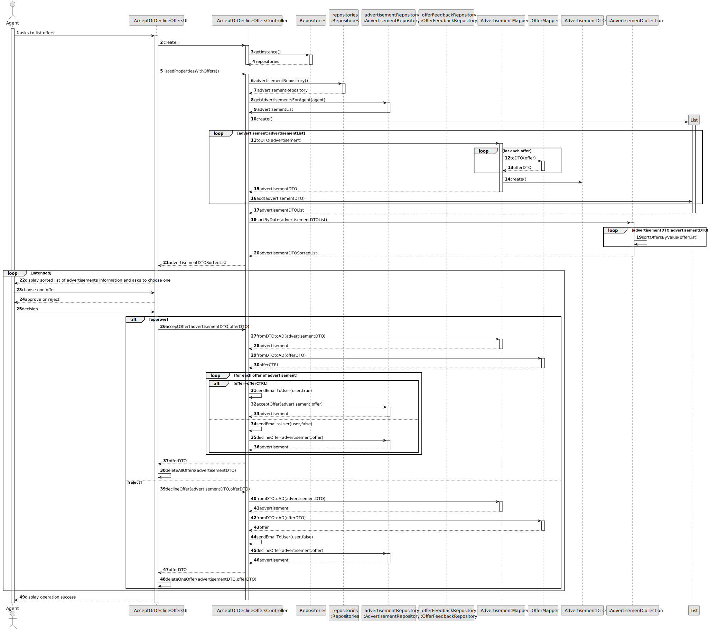
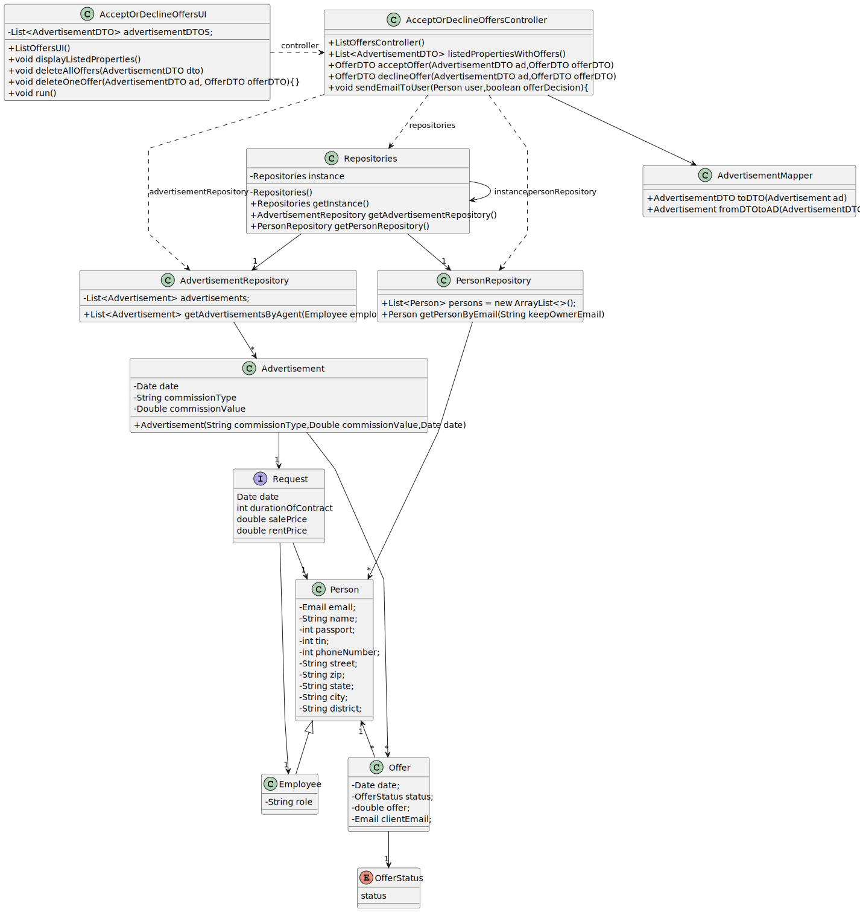

# US 011 - Display Listed Purchase Order

## 3. Design - User Story Realization

### 3.1. Rationale

| Interaction ID | Question: Which class is responsible for...          | Answer                          | Justification (with patterns)                                                                                 |
|:---------------|:-----------------------------------------------------|:--------------------------------|:--------------------------------------------------------------------------------------------------------------|
| Step 1         | ... interacting with the actor?                      | AcceptOrDeclineOffersUI         | Pure Fabrication: there is no reason to assign this responsibility to any existing class in the Domain Model. |
|                | ... coordinating the US?                             | AcceptOrDeclineOffersController | Controller                                                                                                    |
|                | ... get Advertisements list?                         | AdvertisementRepository         | IE: Advertisement Repository knows all advertisements                                                         |
|                | ... responsible for sorting the Advertisements list? | AdvertisementCollection         | Pure fabrication: no other class can assume this function                                                     |
|                | ... get Offers list?                                 | Advertisement                   | IE: Advertisement knows all of his offers                                                                     |
| Step 3         | ... display operation success?                       | AcceptOrDeclineOffersUI         | IE: is responsible for user interactions                                                                      | 

### Systematization ##

According to the taken rationale, the conceptual classes promoted to software classes are:

* Advertisement
* Offer

Other software classes (i.e. Pure Fabrication) identified:

*  AcceptOrDeclineOffersUI
* AcceptOrDeclineOffersController

## 3.2. Sequence Diagram (SD)

### Alternative 1 - Full Diagram

This diagram shows the full sequence of interactions between the classes involved in the realization of this user story.

## 3.3. Class Diagram (CD)

