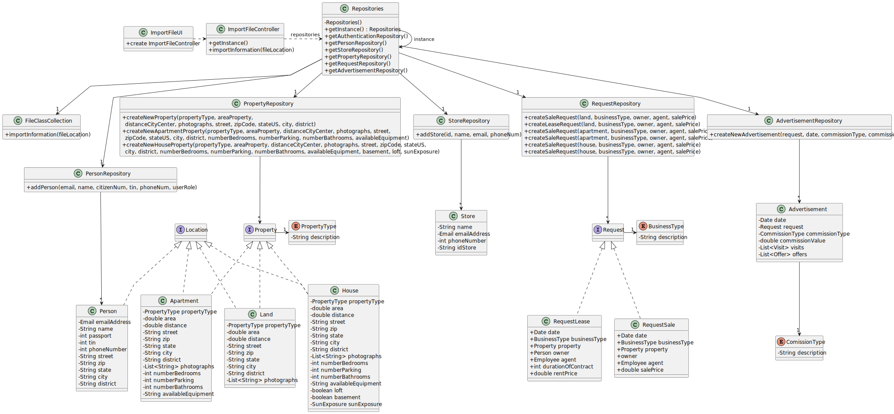

## US 012 - Import information from a legacy system
## 3. Design - User Story Realization 

### 3.1. Rationale

**SSD - Alternative 1 is adopted.**

| Interaction ID | Question: Which class is responsible for... | Answer                  | Justification (with patterns)                                                                                 |
|:---------------|:--------------------------------------------|:------------------------|:--------------------------------------------------------------------------------------------------------------|
| Step 1         | ... interacting with the actor?             | ImportFileUI            | Pure Fabrication: there is no reason to assign this responsibility to any existing class in the Domain Model. |
|                | ... coordinating the US?                    | ImportFileController    | Controller                                                                                                    |
|                | ... instantiating a new Person?             | PersonRepository        | Creator (rule 2): PersonRepository records instances of Person                                                |
|                | ... instantiating a new Store?              | StoreRepository         | Creator (rule 2): StoreRepository records instances of Store                                                  |
|                | ... instantiating a new Property?           | PropertyRepository      | Creator (rule 2): PropertyRepository records instances of Property                                            |
|                | ... instantiating a new Request?            | RequestRepository       | Creator (rule 2): RequestRepository records instances of Request                                              |
|                | ... instantiating a new Advertisement?      | AdvertisementRepository | Creator (rule 2): AdvertisementRepository records instances of Advertisement                                  |
|                | ... knowing the user using the system?      | UserSession             | IE: cf. A&A component documentation.                                                                          |
| Step 2         | ... importing data from the file?           | FileDataCollection      | Pure fabrication: class responsible for importing the data                                                    |
|                | ... filter imported data?                   | FileDataCollection      | Pure fabrication: class responsible for distributing the information to the right objects                     |
| Step 3         | ... save the imported data?                 | Person                  | IE: object created in step 1 has its own data.                                                                |
|                | ... save the imported data?                 | Store                   | IE: object created in step 1 has its own data.                                                                |
|                | ... save the imported data?                 | Property                | IE: object created in step 1 has its own data.                                                                |
|                | ... save the imported data?                 | Request                 | IE: object created in step 1 has its own data.                                                                |
|                | ... save the imported data?                 | Advertisement           | IE: object created in step 1 has its own data.                                                                |
| Step 4         | ... saving the created Person?              | PersonRepository        | IE: owns all its data.                                                                                        |
|                | ... saving the created Store?               | StoreRepository         | IE: owns all its data.                                                                                        |
|                | ... saving the created Property?            | PropertyRepository      | IE: owns all its data.                                                                                        |
|                | ... saving the created Request?             | RequestRepository       | IE: owns all its data.                                                                                        |
|                | ... saving the created Advertisement?       | AdvertisementRepository | IE: owns all its data.                                                                                        |
| Step 5         | ... informing operation success?            | ImportFileUI            | IE: is responsible for user interactions.                                                                     | 

### Systematization ##

According to the taken rationale, the conceptual classes promoted to software classes are: 

 * Person
 * Store
 * Property
 * Request
 * Advertisement

Other software classes (i.e. Pure Fabrication) identified: 

 * ImportFileUI  
 * ImportFileController
 * FileDataCollection

## 3.2. Sequence Diagram (SD)

### Alternative 1 - Full Diagram

This diagram shows the full sequence of interactions between the classes involved in the realization of this user story.

## 3.3. Class Diagram (CD)

