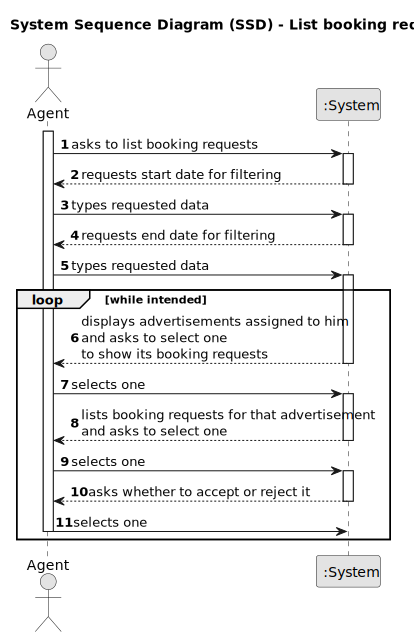

# US 015 - List booking requests

## 1. Requirements Engineering

### 1.1. User Story Description

As an agent, I intend to list all booking requests for properties managed by me.

### 1.2. Customer Specifications and Clarifications 

**From the specifications document:**

>	After consulting a list of properties, the client can request to schedule a visit to the real estate agent for a specific property to verify its conditions. The agent receives the request,  the availability and sends the response.

**From the client clarifications:**

> **Question:** One of our questions' answers made us believe there might have been some miscommunication, as it had some significant mistakes in phrasing and your answer wasn't clear enough. As such, here is that same question, in a simpler and clearer way: US015's AC2 states that "The list of requests must be sorted by date in ascending order. The sorting algorithm to be used by the application must be defined through a configuration file. At least two sorting algorithms should be available." As such, the team would like to know if, just like in US017, the sorting methods would be chosen manually in US015.
>
> **Answer:** In US 15 the sorting algorithm to be used by the application must be defined through a configuration file. This is a diferent strategy from what I want in US17.

> **Question:** In US015's AC1, it is stated that "The list of requests must be shown for a specific period (begin date, end date)." This time period caused confusion, as the team is unsure whether the "date" is referring to the date chosen by the client in the message (See US009's requirements) or the date of creation of the visit request.
> 
> **Answer:** The goal is to use the date chosen by the client (the preferred date that you can see in US9) to list booking requests.

> **Question:** US015's AC1 states that "The list of requests must be shown for a specific period (begin date, end date)". As such, our team would like to know if you want this time period to be selected or typed, and in which format it should be in.
> 
> **Answer:** The dates should be selected. The format should be DD-MM-YYYY.

> **Question:** [US015] Booking is a slightly vague word. Our team wants clarifications on what type of requests the word encompasses (visit requests being our strongest guess, but we are not sure).
> 
> **Answer:** It is a visit request.

### 1.3. Acceptance Criteria

* **AC1:** The list of requests must be shown for a specific period (begin date, end date).
* **AC2:** The list of requests must be sorted by date in ascending order. The sorting algorithm to be used by the application must be defined through a configuration file. At least two sorting algorithms should be available

### 1.4. Found out Dependencies

* There is a dependency to "US002 - Publish Sale Announcement" as a sale announcement needs to already be published so that bookings can be requested.
* There is a dependency to "US003 - Registering a new employee" since an agent needs to be a registered employee so as to be able to publish the offer.
* There is a dependency to "US009 - Client Schedule Visit" as a visit needs to already have been requested so that the agent can respond to it.

### 1.5 Input and Output Data

**Input Data:**

* Typed data:
    * start date,
    * end date

**Output Data:**

* (In)Success of the operation

### 1.6. System Sequence Diagram (SSD)

**Other alternatives might exist.**

