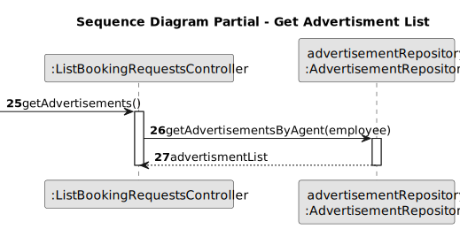

# US 015 - List booking requests

## 3. Design - User Story Realization

### 3.1. Rationale

| Interaction ID | Question: Which class is responsible for...      | Answer                        | Justification (with patterns)                                                                                 |
| :------------- | :----------------------------------------------- | :---------------------------- | :------------------------------------------------------------------------------------------------------------ |
| Step 1         | ... interacting with the actor?                  | ListBookingRequestsUI         | Pure Fabrication: there is no reason to assign this responsibility to any existing class in the Domain Model. |
|                | ... coordinating the US?                         | ListBookingRequestsController | Controller                                                                                                    |
|                | ... knowing the user using the system?           | UserSession                   | IE: cf. A&A component documentation.                                                                          |
| Step 2         | ... asking the required owner data?              | ListBookingRequestsUI         | interacts with the actor                                                                                      |
|                | ... answering the prompt to accept or reject     | User (actor)                  | knows the information                                                                                         |
| Step 4         | ... getting advertisement list?                  | AdvertisementRepository       | Information Expert - Repository that creates and saves a list of advertisements that are created              |
|                | ... answering the prompt to select one           | User (actor)                  | knows the information                                                                                         |
| Step 5         | ... getting visits list?                         | Advertisement                 | Information Expert - Advertisement is responsible for keeping info on visit request to itself                 |
|                | ... answering the prompt to select one           | User (actor)                  | knows the information                                                                                         |
| Step 6         | ... asking the required owner data?              | ListBookingRequestsUI         | interacts with the actor                                                                                      |
|                | ... choosing whether to accept or reject it      | User (actor)                  | knows the information                                                                                         |
| Step 7         | ...changing visit status?                        | Advertisement                 | Information Expert - Advertisement is responsible for keeping info on visit request to itself                 |
| Step 8         | ... asking whether the agent wishes to continue? | ListBookingRequestsUI         | interacts with the actor                                                                                      |
|                | ... answering the prompt                         | User (actor)                  | knows the information                                                                                         |

### Systematization

According to the taken rationale, the conceptual classes promoted to software classes are:

- Advertisement
- Visit
- Person
- PersonRepository
- AdvertisementsRepository

Other software classes (i.e. Pure Fabrication) identified:

- ListBookingRequestsUI
- ListBookingRequestsController

## 3.2. Sequence Diagram (SD)

### Alternative 1 - Full Diagram

This diagram shows the full sequence of interactions between the classes involved in the realization of this user story.

### Alternative 2 - Split Diagram

This diagram shows the same sequence of interactions between the classes involved in the realization of this user story, but it is split in partial diagrams to better illustrate the interactions between the classes.

It uses interaction ocurrence.

**Get Preliminary Info**

**Get Advertisement List**

**Get Visit List**

**Change Visit Status**

## 3.3. Class Diagram (CD)

