# US 016 - Agent respond to a booking request for a visit.

## 3. Design - User Story Realization 

### 3.1. Rationale

**SSD - Alternative 1 is adopted.**

| Interaction ID | Question: Which class is responsible for...     | Answer                          | Justification (with patterns)                                                                                 |
|:---------------|:------------------------------------------------|:--------------------------------|:--------------------------------------------------------------------------------------------------------------|
| Step 1  	      | ... interacting with the actor?                 | RespondBookingRequestUI         | Pure Fabrication: there is no reason to assign this responsibility to any existing class in the Domain Model. |
|                | ... coordinating the US?                        | RespondBookingRequestController | Controller                                                                                                    |
| Step 2         | ... get User Information                        | UserSession                     | IE: cf. A&A component documentation.                                                                          |
| Step 3         | ... get Agent Advertisement List                | AdvertisementRepository         | Repository of the Advertisements in the Company (Information Expert)                                          |
|                | ... create Advertisement DTO List               | AdvertisementMapper             | creates List of AdvertisementDTO    (Information Expert)                                                      |
|                | ... display Advertisement DTO List to choose    | RespondBookingRequestUI         | interacts with the actor                                                                                      |
| 	              | ... chooses Advertisement DTO                   | User (actor)                    | knows the information                                                                                         |
| Step 4         | ... transforms AdvertismentDTO in Advertisement | AdvertisementMapper             | seeks Ad in the AdvertisementDTO (Information Expert)                                                         |
|                | ... get Visit List from Advertisement           | AdvertisementRepository         | Repository of the Advertisements with Visit List (Information Expert)                                         |
|                | ... display Visit List to choose                | RespondBookingRequestUI         | interacts with the actor                                                                                      |
| 	              | ... chooses Visit Type                          | User (actor)                    | knows the information                                                                                         |
| Step 5         | ... ask to respond to visit request             | RespondBookingRequestUI         | interacts with the actor                                                                                      |
|                | ... respond visit request                       | User (actor)                    | knows the information                                                                                         |
| Step 6         | ... get Client Email to respond                 | AdvertisementRepository         | Repository of the Advertisements with Visit List, Visit contains Client Email (Information Expert)            |
|                | ... get Client Name from email                  | PersonRepository                | Repository of the Persons registerd in the System (Information Expert)                                        |
|                | ... get Email Platform                          | ApplicationSession              | IE: responsable application config propertys                                                                  |
|                | ... respond to Client visit request             | SendMessageAdapter              | IE & Protected Variation & Reflection: Adapter to email Plataform from Application information.               |
| Step 9         | ... display operation success                   | RespondBookingRequestUI         | Is responsible for user interactions.                                                                         | 

### Systematization ##

According to the taken rationale, the conceptual classes promoted to software classes are:

* AdvertisementRepository

Other software classes (i.e. Pure Fabrication) identified:

* RespondBookingRequestUI
* RespondBookingRequestController
* AdvertisementMapper
* SendMessageAdapter
* UserSession
* ApplicationSession

## 3.2. Sequence Diagram (SD)

### Alternative 1 - Full Diagram

This diagram shows the full sequence of interactions between the classes involved in the realization of this user story.

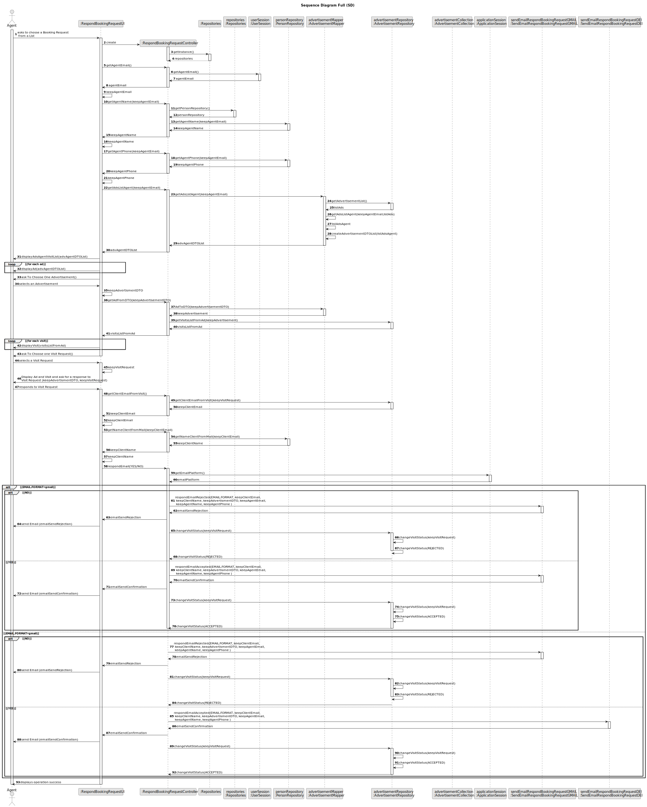

### Alternative 2 - Split Diagram

This diagram shows the same sequence of interactions between the classes involved in the realization of this user story, but it is split in partial diagrams to better illustrate the interactions between the classes.

It uses interaction ocurrence.

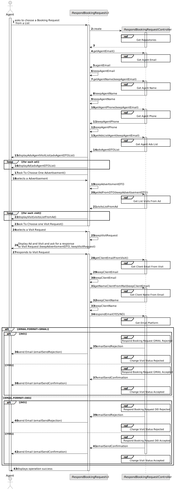

**Get Repositories Acess Partial SD**

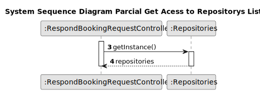

**Get Agent Email**

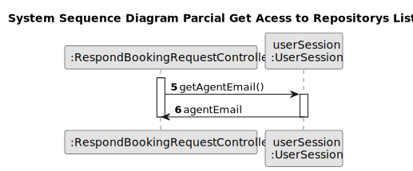

**Get Agent Name**

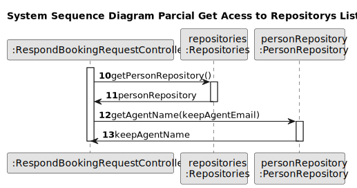

**Get Agent Phone**

**Get Agent Advertisement List**

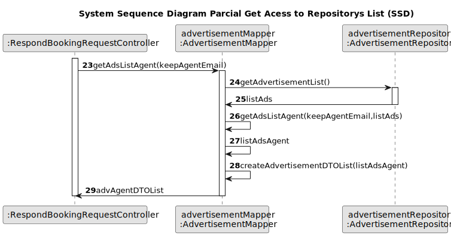

**Get Visits From Advertisement**

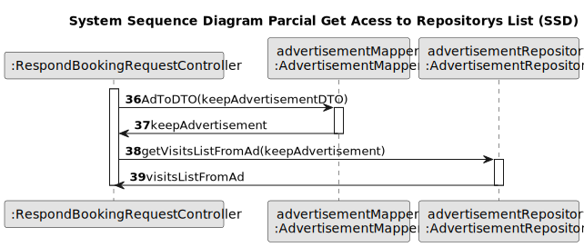

**Get Client Email From Visit**

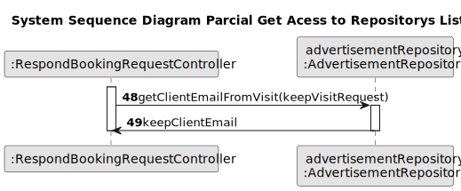

**Get Client Name**

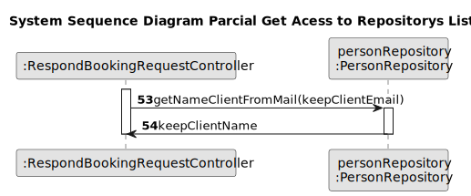

**Get Email Platform**

**Respond Email Reject**

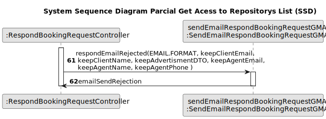

**Change Visit Status Reject**

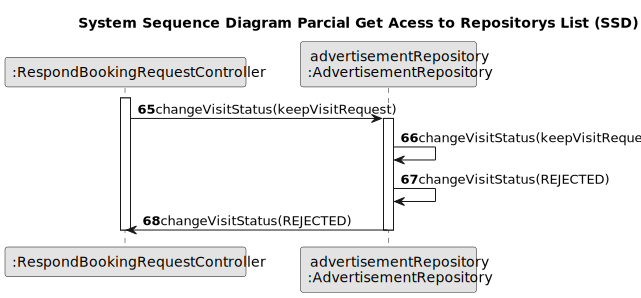

**Respond Email Accepted**

**Change Visit Status Accepted**

## 3.3. Class Diagram (CD)

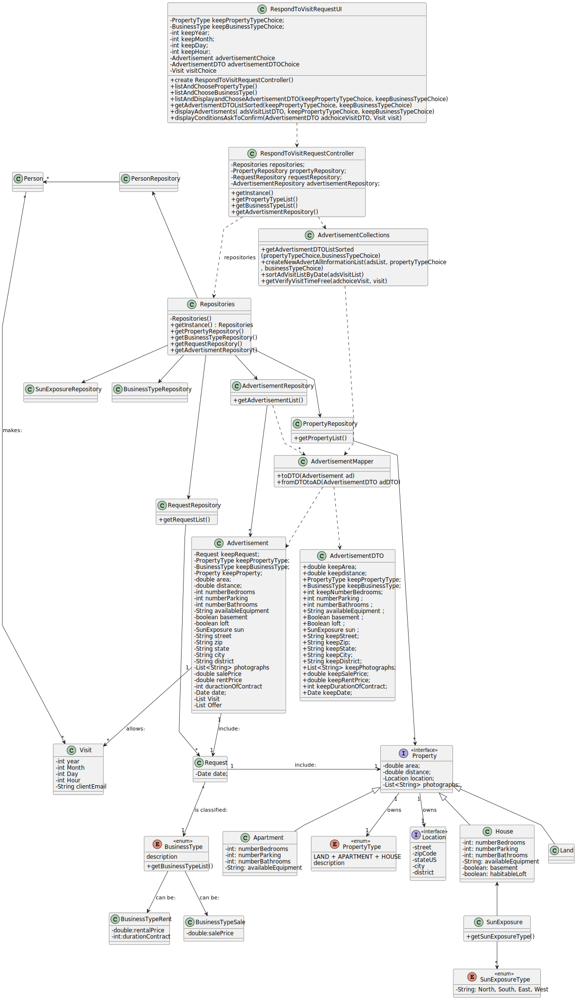