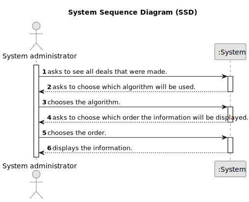

# US 017 - List all deals made

## 1. Requirements Engineering

### 1.1. User Story Description

As a network manager, I want to list all deals made.

### 1.2. Customer Specifications and Clarifications 

**From the specifications document:**

> The company's network manager is responsible for choosing the algorithm and the order in which the deals should be sorted.

**From the client clarifications:**

> Q1: What should be the default order of the deals when displaying them to the network manager?
>
> A1: The default is to sort deals from the most recent ones to the oldest ones.

> Q2: In this User Story it is requested that "All deals made" are listed. Are these deals just accepted purchase requests, or are declined purchase requests also included?
>
> A2: A deal takes place when the proposed purchase/renting is accepted.

> Q3: Can you confirm that we are analyzing the deals made in all the branches all together?
>
> A3: Yes, we are analyzing the deals made in all the branches all together.

> Q4: Regarding the Algorithms, is it supposed to be one for each sorting order, or must both algorithms present both sorting orders?
>
> A4: The two algorithms can be used for both sorting orders.

> Q5: We have to present information about the deal, but is it necessary to display any information about the agent/agency that oversees the deal?
>
> A5: Yes, show the store ID and the store name

### 1.3. Acceptance Criteria

* **AC1:** The actor should be able to sort all properties by property area (square feet) in descending/ascending ordert.
* **AC2:** Two sorting algorithms should be implemented (to be chosen manually by the network manager).
* **AC3:** Worst-case time complexity of each algorithm should be documented in the application user manual that must be delivered with the application (in the annexes, where algorithms should be written in pseudocode).

### 1.4. Found out Dependencies

* US003 
### 1.5 Input and Output Data

**Input Data:**

* Typed data:

* Selected data:
    * Algorithm
    * Order

**Output Data:**

* Success of the operation

### 1.6. System Sequence Diagram (SSD)

### 1.7 Other Relevant Remarks

n/a