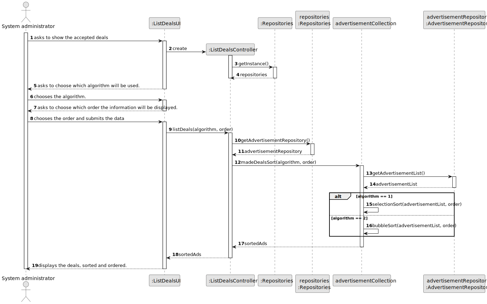
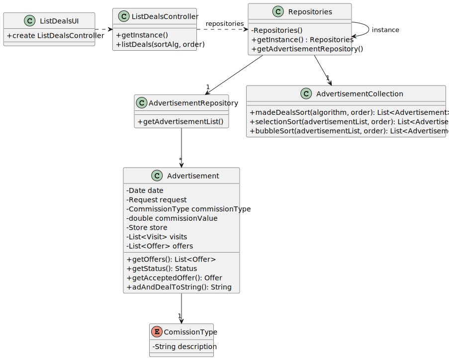

## US 017 - List all deals made
## 3. Design - User Story Realization 

### 3.1. Rationale

**SSD - Alternative 1 is adopted.**

| Interaction ID | Question: Which class is responsible for...        | Answer                   | Justification (with patterns)                                                                                 |
|:---------------|:---------------------------------------------------|:-------------------------|:--------------------------------------------------------------------------------------------------------------|
| Step 1         | ... interacting with the actor?                    | ListDealsUI              | Pure Fabrication: there is no reason to assign this responsibility to any existing class in the Domain Model. |
|                | ... coordinating the US?                           | ListDealsController      | Controller                                                                                                    |
|                | ... knowing the network manager using the system?  | UserSession              | IE: cf. A&A component documentation.                                                                          |
| Step 2         | ... get advertisement list?                        | AdvertisementRepository  | Information Expert: Repository of the advertisements                                                          |
|                | ... filters advertisements by accepted deals?      | AdvertisementCollection  | Pure fabrication: class responsible for filtering the data                                                    |
|                | ... sorts advertisements?                          | AdvertisementCollection  | Pure fabrication: class responsible for sorting advertisements                                                |                                                             |
| Step 3         | ... display filtered and sorted advertisement list | ListDealsUI              | IE: is responsible for user interactions                                                                      |

### Systematization ##

According to the taken rationale, the conceptual classes promoted to software classes are: 

* AdvertisementRepository

Other software classes (i.e. Pure Fabrication) identified: 

 * ListDealsUI  
 * ListDealsController
 * AdvertisementCollection

## 3.2. Sequence Diagram (SD)

### Alternative 1 - Full Diagram

This diagram shows the full sequence of interactions between the classes involved in the realization of this user story.

## 3.3. Class Diagram (CD)

