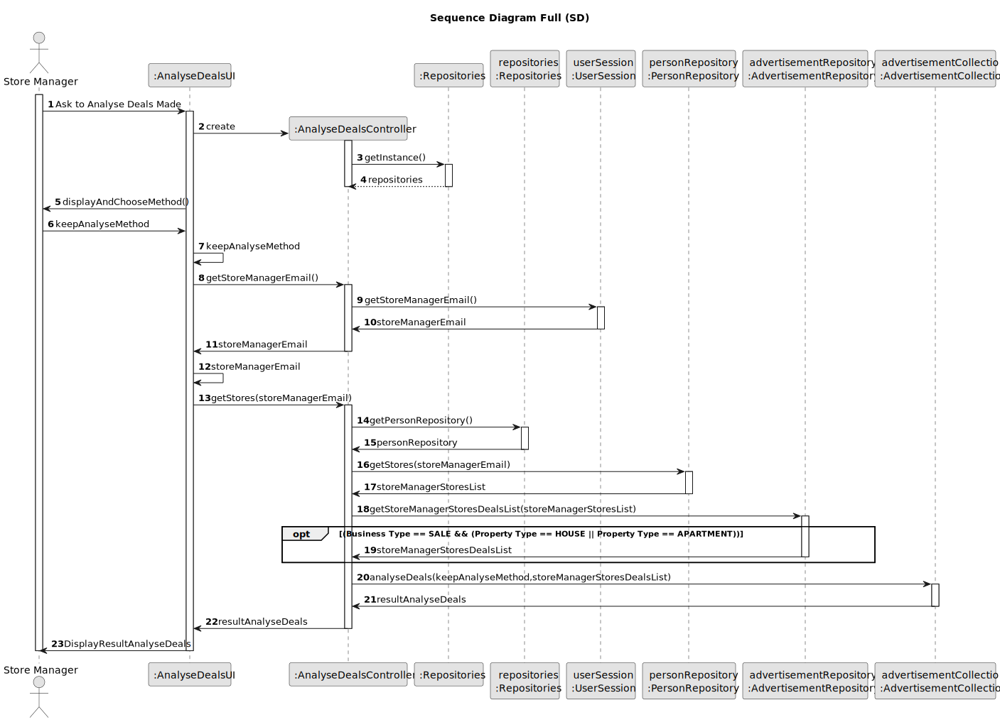

# US 018 - Store Manager Analyses deals.

## 3. Design - User Story Realization 

### 3.1. Rationale

**SSD - Alternative 1 is adopted.**

| Interaction ID | Question: Which class is responsible for... | Answer                   | Justification (with patterns)                                                                                 |
|:---------------|:--------------------------------------------|:-------------------------|:--------------------------------------------------------------------------------------------------------------|
| Step 1  	      | ... interacting with the actor?             | AnalyseDealsUI           | Pure Fabrication: there is no reason to assign this responsibility to any existing class in the Domain Model. |
|                | ... coordinating the US?                    | AnalyseDealsController   | Controller                                                                                                    |
| Step 2         | ... ask Analyses Method                     | AnalyseDealsUI           | interacts with the actor                                                                                      |
| 	              | ... chooses Analyses Method                 | User (actor)             | knows the information                                                                                         |
| Step 3         | ... get Store Manager Email                 | UserSession              | IE: cf. A&A component documentation.                                                                          |
|                | ... get Stores from Store Manager Email     | PersonRepository         | Repository of the Persons registerd in the System (Information Expert)                                        |
|                | ... get Advertisement List from Store Info  | AdvertisementRepository  | Repository of the Advertisements in the Company (Information Expert)                                          |
| Step 4         | ... Analyse Deals                           | AdvertisementCollections | Pure fabrication: class responsible for sorting anf filtering advertisements                                  |
|                | ... display Result Analyse Deals            | AnalyseDealsUI           | interacts with the actor                                                                                      |

### Systematization ##

According to the taken rationale, the conceptual classes promoted to software classes are:

* PersonRepository
* AdvertisementRepository

Other software classes (i.e. Pure Fabrication) identified:

* MakeOfferController
* AdvertisementCollections

## 3.2. Sequence Diagram (SD)

### Alternative 1 - Full Diagram

This diagram shows the full sequence of interactions between the classes involved in the realization of this user story.

## 3.3. Class Diagram (CD)

