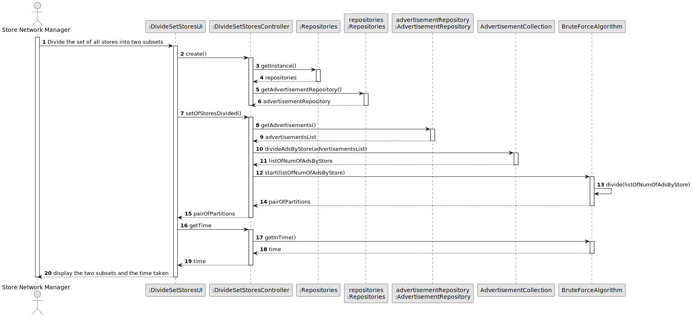
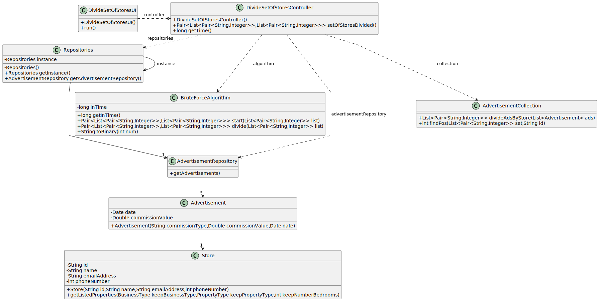

# US 019 - Divide the set of all stores into two subsets

## 3. Design - User Story Realization 

### 3.1. Rationale

| Interaction ID | Question: Which class is responsible for...                      | Answer                      | Justification (with patterns)                                                                                 |
|:---------------|:-----------------------------------------------------------------|:----------------------------|:--------------------------------------------------------------------------------------------------------------|
| Step 1         | ... interacting with the actor?                                  | DivideSetOfStoresUI         | Pure Fabrication: there is no reason to assign this responsibility to any existing class in the Domain Model. |
|                | ... coordinating the US?                                         | DivideSetOfStoresController | Controller                                                                                                    |
| Step 2         | ... knowing the advertisements?                                  | AdvertisementRepository     | IE: AdvertisementRepository knows all of the advertisements.                                                  |
|                | ... knowing the advertisement store?                             | Advertisement               | IE: Advertisement know the store that he is associated.                                                       |
|                | ... create list of pairs with store id and number of properties? | AdvertisementCollection     | Pure Fabrication: there is no reason to assign this responsibility to any existing class in the Domain Model. |
| Step 3         | ... display the partitions?                                      | DivideSetOfStoresUI         | Pure Fabrication: is responsible for user interactions.                                                       | 

### Systematization ##

According to the taken rationale, the conceptual classes promoted to software classes are: 

 * Advertisement
 * Store

Other software classes (i.e. Pure Fabrication) identified: 

 * DivideSetOfStoresUI  
 * DivideSetOfStoresController

## 3.2. Sequence Diagram (SD)

### Alternative 1 - Full Diagram

This diagram shows the full sequence of interactions between the classes involved in the realization of this user story.

## 3.3. Class Diagram (CD)

